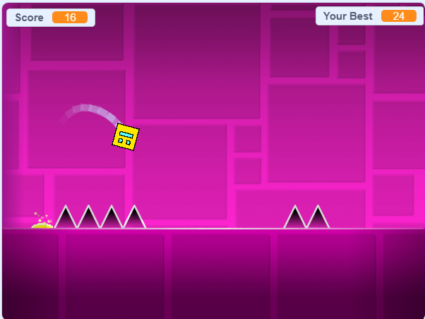

# Geometric Dash Game

[](https://geometric-dash-8sehrtk9h-ankitbhagat2062s-projects.vercel.app)

## Overview

This is a clone of the popular **Geometric Dash** game created as part of my CS50 Introduction to Computer Science course assignment. The game was built using **Scratch**, a visual programming language designed for kids, and then converted to HTML using **Htmlifier** for web deployment.

## About CS50

This project was completed as part of **Week 0** of [CS50: Introduction to Computer Science](https://pll.harvard.edu/course/cs50-introduction-computer-science) from Harvard University. The assignment focused on introducing students to computational thinking through visual programming.

## Project Details

- **Assignment Grade**: 2/2 (Full Marks)
- **Original Scratch Project**: [Geometric Dash on Scratch](https://scratch.mit.edu/projects/1201934945)
- **GitHub Repository**: [Geometric-Dash on GitHub](https://github.com/Ankitbhagat2062/Geometric-Dash)
- **Live Demo**: [Play Geometric Dash](https://geometric-dash-8sehrtk9h-ankitbhagat2062s-projects.vercel.app)

## About Geometric Dash

Geometric Dash is a popular rhythm-based platformer game where players control a cube that jumps and moves automatically. The objective is to navigate through levels filled with obstacles synchronized to the beat of the music without colliding with any obstacles.

## How It Was Made

### 1. Scratch Development
- Created using [Scratch](https://scratch.mit.edu/), a block-based visual programming language
- Designed sprites, backgrounds, and game mechanics using Scratch's intuitive interface
- Implemented physics, collision detection, and scoring systems using visual code blocks

### 2. HTML Conversion
- Converted from Scratch to HTML using [Htmlifier](https://sheeptester.github.io/htmlifier/)
- Htmlifier packages Scratch projects into standalone HTML files that can run in web browsers
- Preserves all game functionality while making it web-compatible

### 3. Deployment
- Uploaded to GitHub for version control
- Hosted on Vercel for public access

## How to Play

1. **Controls**: 
   - Press the **spacebar** or **up arrow** to make the character jump
   - Click the green flag to start the game
   - Click the red stop sign to reset the game

2. **Objective**:
   - Navigate through the level without hitting obstacles
   - Try to achieve the highest score possible
   - Each successful pass through an obstacle increases your score

3. **Features**:
   - Physics-based movement
   - Score tracking
   - Multiple levels of increasing difficulty
   - Synchronized music and gameplay

## Technical Information

### Project Structure
```
├── index.html          # Main game file
├── CSS/
│   └── style.css       # Game styling
├── JS/
│   ├── main.js         # Game logic
│   ├── vm.js           # Virtual machine
│   └── Error.js        # Error handling
├── Images/             # Game assets
├── Icons/              # UI icons
└── Music_Sounds/       # Audio files
```

### Technologies Used
- **Scratch**: Visual programming language
- **JavaScript**: Game logic and interactions
- **HTML/CSS**: Structure and styling
- **Htmlifier**: Scratch to HTML conversion tool

## Development Process

1. **Design Phase**: 
   - Planned game mechanics and level design
   - Created sprites and backgrounds in Scratch

2. **Implementation Phase**:
   - Programmed character movement and physics
   - Implemented collision detection
   - Added scoring system and UI elements

3. **Testing Phase**:
   - Tested gameplay mechanics
   - Adjusted difficulty and timing
   - Verified scoring system

4. **Deployment Phase**:
   - Converted to HTML using Htmlifier
   - Uploaded to GitHub repository
   - Deployed to Vercel for public access

## Learning Outcomes

This project helped me understand:
- Visual programming concepts
- Game design principles
- Event-driven programming
- Basic physics implementation
- Web deployment processes

## Play the Game

You can play the game in several ways:

1. **Online**: Visit the [live demo](https://geometric-dash-8sehrtk9h-ankitbhagat2062s-projects.vercel.app)
2. **Locally**: Download the repository and open `index.html` in your browser
   or 
   
     ``` 
      git clone https://github.com/Ankitbhagat2062/Geometric-Dash.git 
    ```
3. **Scratch**: View the original project on [Scratch](https://scratch.mit.edu/projects/1201934945)

## Acknowledgements

- [Scratch Team](https://scratch.mit.edu/) for creating an accessible programming platform
- [Htmlifier](https://sheeptester.github.io/htmlifier/) for the Scratch to HTML conversion tool
- [CS50 Team](https://cs50.harvard.edu/) for the educational opportunity

## License

This project is for educational purposes as part of the CS50 course requirements.
